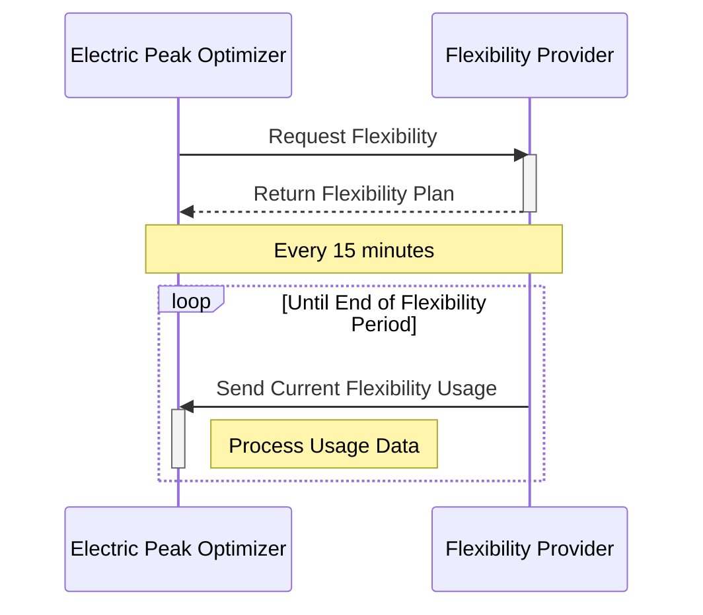

# YogaCharge Public API Documentation

This document serves as the central tracking tool for any and all discussions and decisions regarding the public API
for YogaCharge. Precisely speaking, this repository serves as a collaborative tool for the interaction between a the
optimizer for the Electric Grid Operators (regarding their consumption figures) and Flexibility Providers (regarding
consumption profiles for EVs etc.).

> [!NOTE]
> This document uses the GitHub extended markdown syntax. See https://github.github.com/gfm/ for more details.
> 
> 

