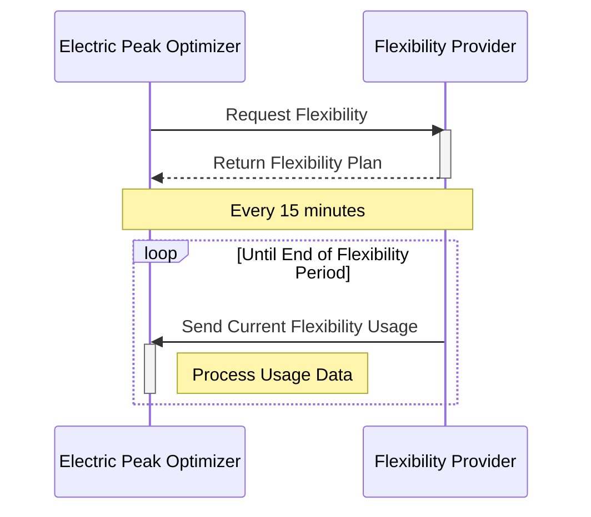

# YogaCharge Public API Documentation

This document serves as the central tracking tool for any and all discussions and decisions regarding the public API
for YogaCharge. Precisely speaking, this repository serves as a collaborative tool for the interaction between a the
optimizer for the Electric Grid Operators (regarding their consumption figures) and Flexibility Providers (regarding
consumption profiles for EVs etc.).

The documented API-Spec consists of two different OpenAPI specs. One is for the [_Flexibility Provider_](flexbility_provider.yml), and one is for
the [_Electric Peak Optimizer_](electric_peak_optimizer.yml).   

> [!NOTE]
> This document uses the GitHub extended markdown syntax. See https://github.github.com/gfm/ for more details.
> 
>

## Decision records

In the directory `/decisions`, decisions regarding the API are documented. These involve a changelog in form
of a table, with the issue that was discussed, participants as well as the conclusions.

Overall speaking, a cross cutting decision was made for all issues. The API path layout will be structured as follows:

- `api/v0/*` is to be used for in progress functionality
  - The definitions at this level are volatile and part of ongoing evaluation. Hence it is important to note that they
    will and can be buggy, error prone or fully change.
  - Anything at this level is subject to feedback and improvements, so open for participation
- `api/v(n>0)/*` is for productive usage
  - Anything at this level is set in stone and will only receive _extensions_ and _bug fixes_. Nothing like repurposed 
    variables, functionality or the likes is to be made.
  - In case of a given endpoint (i.e. `api/v1/flexibility-request`) receiving a new and improved protocol, it is to be
    deployed as `api/v2/flexibility-request`

